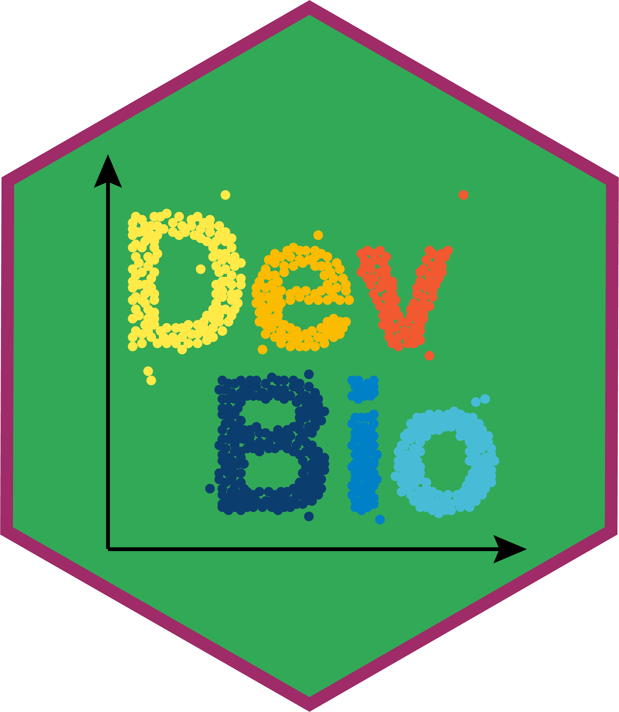

# Dev Bio scRNA-seq Workshop 

Welcome to the Section of Developmental Biology single cell RNA-sequencing workshop GitHub page! Here you will find all the code needed for the workshop.

## Workshop Description
In this workshop you will learn how to analyze single cell RNA-sequencing data produced by popular upstream processing pipelines (like the Chromium 10x platform Cell Ranger) using Python and R. This will include reading  data into either a Python or R coding environment, preprocessing the data (filtering cells, normalization, feature selection, and dimensionality reduction), clustering and cell type annotation, and pseudotime/trajectory inference analysis.

## Workshop Goals
This workshop is a crash course in scRNA-seq analysis. It was designed to give you a sense for the general steps and processes involved in analyzing scRNA-seq data, and provide an overview for good analysis practices. We do not expect you to leave this workshop as bioinformatics experts (it takes years to become an expert on anything!). Rather, this workshop should serve as an introduction that gives you the toolkits and confidence you need to start doing your own analysis. While you may not remember the exact snippets of code you need at each step (which is totally fine! Bioinformaticians don't have everything memorized either. Google is your friend), we hope you will leave our workshop with a basic understanding and appreciation for:
* Python and R programming essentials
* scRNA-seq analysis principles and concepts
* scRNA-seq best practices

We also hope you will leave our workshop with some ideas on how to analyze your own data!

## Prerequisites
None! While this is not an inclusive introduction to Python/R course, and while we will be covering a lot of material fast, we believe that anyone can learn to do their own scRNA-seq analysis and want to make bioinformatics as accessible (and fun!) as possible. To that end, we have provided both an *Intro to Python* and an *Intro to R* tutorial to help you quickly get up to speed with some programming basics. Will completing these tutorials make you an expert? No, but they will help you get a feel for programming in both Python and R and help you take your first steps towards becoming a bioinformatics wizard!

## Installation Instructions
### Git and GitHub
### Docker